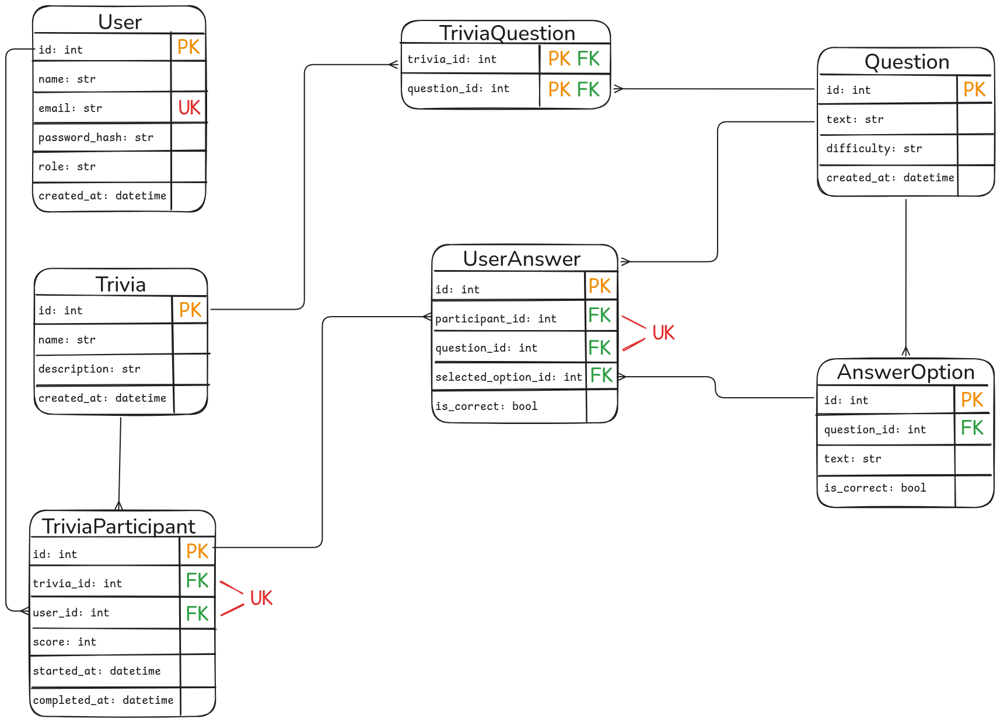

# Estructura de la base de datos

## Diagrama

---

## Detalle de Tablas

### User

Almacena a los usuarios de la plataforma.

| Column          | Type     | Constraints | Description                              |
|-----------------|----------|-------------|------------------------------------------|
| `id`            | int      | PK          |                                          |
| `name`          | str      | NOT NULL    | Nombre de usuario                        |
| `email`         | str      | UK, NOT NULL| Email del usuario (debe ser único)       |
| `password_hash` | str      | NOT NULL    | Hash de la contraseña (bcrypt)           |
| `role`          | str      | NOT NULL    | Rol del usuario (`admin`, `player`)      |
| `created_at`    | datetime | NOT NULL    | Fecha y hora de la creación              |

---

### Trivia

Almacena las trivias creadas por User con role 'admin'.

| Column        | Type     | Constraints | Description                    |
|---------------|----------|-------------|--------------------------------|
| `id`          | int      | PK          |                                |
| `name`        | str      | NOT NULL    | Nombre de la trivia            |
| `description` | str      |             | Descripción opcional           |
| `created_at`  | datetime | NOT NULL    | Fecha y hora de la creación    |

---

### Question

Almacena preguntas, las cuales pueden ser reutilizadas para diferentes trivias.

| Column       | Type     | Constraints | Description                              |
|--------------|----------|-------------|------------------------------------------|
| `id`         | int      | PK          |                                          |
| `text`       | str      | NOT NULL    | Texto de la pregunta                     |
| `difficulty` | str      | NOT NULL    | Nivel de dificultad (`easy`, `medium`, `hard`)|
| `created_at` | datetime | NOT NULL    | Fecha y hora de la creación              |

---

### AnswerOption

Almacena las posibles respuestas de una Question.

| Column        | Type | Constraints    | Description                             |
|---------------|------|----------------|-----------------------------------------|
| `id`          | int  | PK             |                                           |
| `question_id` | int  | FK → Question  | ID de la Question a la que pertence       |
| `text`        | str  | NOT NULL       | Texto de la opción a la pregunta          |
| `is_correct`  | bool | NOT NULL       | Es correcta?                              |

---

### TriviaQuestion

Tabla pivote entre Trivia y Question (many-to-many).

| Column        | Type | Constraints    | Description                    |
|---------------|------|----------------|--------------------------------|
| `trivia_id`   | int  | PK, FK → Trivia   | ID de la Trivia                  |
| `question_id` | int  | PK, FK → Question | ID de la Question                |

---

### TriviaParticipant

Almacena la participación de un User en una Trivia específica.

| Column         | Type     | Constraints       | Description                                          |
|----------------|----------|-------------------|------------------------------------------------------|
| `id`           | int      | PK                |                                                      |
| `trivia_id`    | int      | FK → Trivia       | ID de la Trivia en la que participa                  |
| `user_id`      | int      | FK → User         | ID del User participante                             |
| `score`        | int      |                   | Puntaje final obtenido                               |
| `started_at`   | datetime |                   | Fecha y hora en que el usuario inició la trivia      |
| `completed_at` | datetime |                   | Fecha y hora de finalización (null si está en curso) |

> La combinación de `(trivia_id, user_id)` es única, un usuario puede solamente participar una única vez en una trivia.

---

### UserAnswer

Almacena la respuesta seleccionada por un TriviaParticipant para cada Question de una Trivia.

| Column | Type | Constraints | Description |
|--------|------|-------------|-------------|
| `id` | int | PK | |
| `participant_id` | int | FK → TriviaParticipant | ID del TriviaParticipant que respondió |
| `question_id` | int | FK → Question | ID de la Question respondida |
| `selected_option_id` | int | FK → AnswerOption | ID de la AnswerOption seleccionada |
| `is_correct` | bool | NOT NULL | Indica si la respuesta es correcta |

> La combinación de `(participant_id, question_id)` es única, un TriviaParticipant puede responder una única vez una Question, este diseño genera una implementación idempotente a nivel de base de datos.